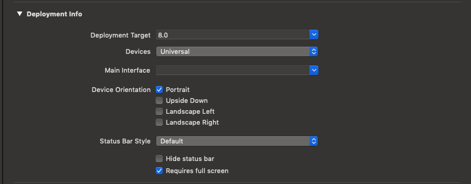

# Programmatic UIViewController

## Problem with storyboards and `.xib` files

When I begin learning iOS development, I was introduced to storyboards and `.xib` files.
However, I soon realized a few drawbacks:

* Dragging `IBOutlet` into the code files is tedious.
* Renaming the views is difficult. 
Every time I use the rename function, the storyboard or the `.xib` file is broken.
Then I had to remove the reference in storyboard and repeat the tedious dragging.
* There are merge conflicts when multiple developers work on a same storyboard.
* Pure code approach allows easy reusability with copy - paste.

Therefore, I decided that I would not use storyboards and `.xib` files for my project (at least for most of what I do).

## Getting rid of storyboards

There are already a few tutorials for ditching the storyboards (such as [this one](https://medium.com/ios-os-x-development/ios-start-an-app-without-storyboard-5f57e3251a25)) so I will only provide a summary here.

### Tell XCode not to use Storyboard on launch
Go to `General > Deployment Info > Main Interface` and clear that field.



### Do the launching on our own
Go to `AppDelegate` and override `didFinishLaunchWithOptions`

```swift
func application(_ application: UIApplication, 
	didFinishLaunchingWithOptions launchOptions: [UIApplicationLaunchOptionsKey: Any]?
) -> Bool {
    window = UIWindow(frame: UIScreen.main.bounds)
    
    // Without navigation controller
    let loginController = LoginScreenViewController()
    window?.rootViewController = loginController
    
	// With navigation controller
    let navController = UINavigationController(rootViewController: loginController)
    window?.rootViewController = navController
    
    // Show window to screen
    window?.makeKeyAndVisible()
    return true
}
```
That's it! 
Our `UIViewController` now does not depend on a Storyboard.

## Fix fat UIVIewController

When opting in for programmatic `UIVIewController`, the `UIViewController` tends to become bloated because we have to do the setup and layout of child views in code either using `NSLayoutConstraints` or using `CGRect` and `setFrame`.

We will take a login screen as an example.

```swift
class LoginScreenViewController: UIViewController {
	private var usernameLabel = UILabel()
	private var usernameTextField = UITextField()
	private var passwordLabel = UILabel()
	private var passwordTextField = UITextField()
	private var loginButton = UIButton()
	private var errorMessageLabel = UILabel()
	
	override func viewDidLoad() {
		super.viewDidLoad()
		// do some related view setup, such as setting label
		// setting colors, fonts, etc.
		
		view.addSubview(usernameLabel)
		view.addSubview(usernameTextField)
		view.addSubview(passwordLabel)
		view.addSubview(passwordTextField)
		view.addSubview(loginButton)
		view.addSubview(errorMessageLabel)
		
		setupNSLayoutConstraints()
	}
	
	private func setupNSLayoutConstraints() {
		// do view layout using constraints here if we use NSLayoutConstraints
	}
	
	override func viewDidLayoutSubviews() {
		super.viewDidLayoutSubviews()
		// do view layout programmatically here if we use setFrame(CGRect)
	}
}
```

As a result, it is a good idea to separate the view into a dedicated class.

To achieve this, we override the `loadView()` method of `UIViewController`.

```swift
class LoginScreenViewController: UIViewController {
	private lazy var loginScreenView: LoginScreenView = {
		return LoginScreenView(handler: self)
	}()
	
	override func loadView() {
		view = loginScreenVieww
	}
}
```

As we can see the UIViewController now is much cleaner.
Also note that we do not need to override `viewDidLayoutSubview()` anymore.
This is because the `loginScreenView` is our root view in `UIViewController` and its `setFrame` method is implicitly called whenever its bounds are changed.

`LoginScreenView` is a new class that do the heavy lifting for us. 
It encapsulates view layout logic and update its child view when we set new frame.

```swift
class LoginScreenView: UIView {
	private weak var handler: LoginScreenActionHandler?
	private lazy var usernameLabel: UILabel = {
		let v = UILabel()
		// Do specific setup to this view
		return v
	}()
	
	private lazy var usernameTextField: UITextField = {
		let v = UITextField()
		// Do specific setup to this view
		return v
	}()	
	
	private lazy var passwordLabel: UILabel = {
		let v = UILabel()
		// Do specific setup to this view
		return v
	}()
	
	private lazy var passwordTextField: UITextField = {
		let v = UITextField()
		// Do specific setup to this view
		return v
	}()
	
	private lazy var loginButton: UIButton = {
		let v = UIButton()
		// Do specific setup to this view
		return v
	}()
	
	private lazy var errorMessageLabel: UILabel = {
		let v = UILabel()
		// Do specific setup to this view
		return v
	}()
	
	init(handler: LoginScreenActionHandler) {
		super.init(frame: .zero)
		addSubview(usernameLabel)
		addSubview(usernameTextField)
		addSubview(passwordLabel)
		addSubview(passwordTextField)
		addSubview(loginButton)
			
		self.handler = handler
		setupNSLayoutConstraints()
	}
	
	// do constraints layout if applicable
	private func setupNSLayoutConstraints() { }

	override var frame: CGRect {
		didSet {
			// Do frame layout if applicable
		}
	}
}
```

The `handler` in the constructor is a delegate, we use that `handler` to notify our `LoginScreenViewController` of any user's interaction.
Because the functionality of login screen is to login, I will use that function as an example.

```swift
protocol LoginScreenActionHandler: class {
	func loginScreenActionHandler(performLogin username: String, password: String)
}

extension LoginScreenViewController: LoginScreenActionHandler {
	func loginScreenActionHandler(performLogin username: String, password: String) {
		loginUseCase.execute(username: username, password: password)
	}
}
```

Some notes:

* The use of `lazy var` in `LoginScreenView` is a personal preference and does not contribute much to this particular post.
* We keep reference to `LoginScreenView` in the `LoginScreenViewController` in case we need to do update view according to our specialized need (such as setting error message when login credentials are wrong).
* The `handler` in our `LoginScreenView` should be a `weak var` to avoid retain cycle (most `delegate` in my opinion should be made `weak`).
* `loginUseCase` is a loose implementation of the **command design pattern**.
The `loginUseCase` object held a weak reference to our `LoginScreenViewController` as a `LoginUseCaseDelegate`

```swift
class LoginUseCase {
	private weak var delegate: LoginUseCaseDelegate?
	
	init(delegate: LoginUseCaseDelegate) {
		self.delegate = delegate
	}
	
	func execute(username: String, password: String) {
		// Call API to login
		// If fail
		delegate?.loginUseCase(didFail: "Wrong password.")
		
		// If success
		delegate?.loginUseCase(didSucceed: userInfo)
	}
}

protocol LoginUseCaseDelegate: class {
	func loginUseCase(didFail error: Error)
	func loginUseCase(didSucceed userInfo: UserInfo)
}
```


The snippet demonstrate possible interaction between the `LoginScreenViewController` and `LoginScreenView`:

```swift
extension LoginScreenViewController: LoginUseCaseDelegate {
	private func loginUseCase(didFail error: Error) {
		loginScreenView.setErrorText(using: error.localizedMessage)
	}
}
```

Visit [my Github repository](https://github.com/bachld97) for full code demo of this login screen.

## Additional comments

* We can go further and turn our labels into specific subclass of `UILabel` such as `AuthenticateUsernameLabel` and `AuthenticatePasswordLabel` to reuse it with ease in `SignupScreenViewController` for example.
* Some people may prefer to pass a closure into the `LoginScreenView` instead of passing a delegate.
Personally, I use delegate because I want a descriptive name in the callback.
* We can make all UI into a separate class and completely decoupled its configuration from its use `private lazy var usernameLabel = UsernameLabel()` for example.
This approach can make the class count explodes, so I avoid using it unless the view is complex with its own display logic.

## Reference

* Bob the developer's article: [Why I Don't Use Storyboard](https://www.bobthedeveloper.io/blog/why-i-don%E2%80%99t-use-storyboard)
* Boris Ohayon's article: [iOS — Start an app without a storyboard](https://medium.com/ios-os-x-development/ios-start-an-app-without-storyboard-5f57e3251a25)
* Paul Hudson's talk: [Separation of concerns: Refactoring view controllers](https://www.youtube.com/watch?v=hIaPdjS5GNo&t=1568s)
* Lets build that app's Youtube video: [Swift: My Secret to Fixing Fat View Controller: Subclassing](https://www.youtube.com/watch?v=dSdkYEjLI3w)	